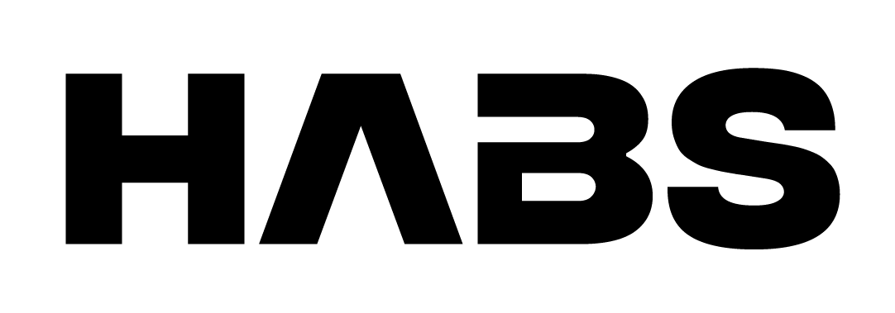
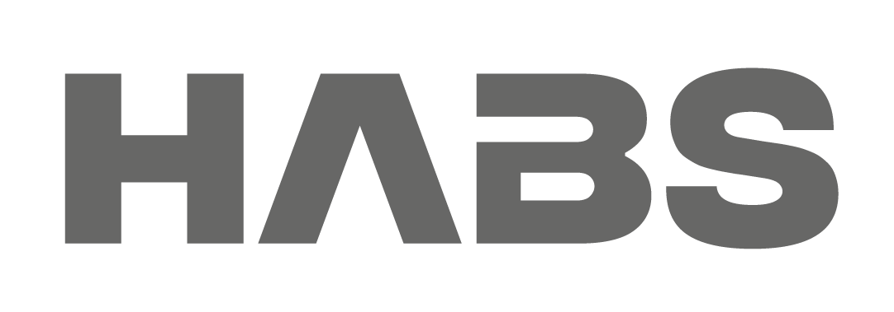
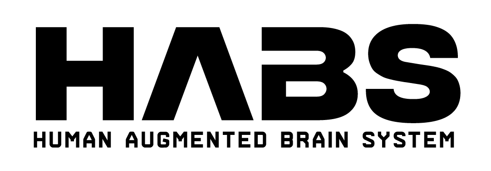
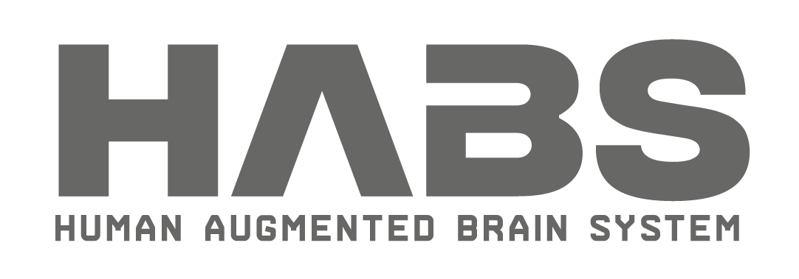
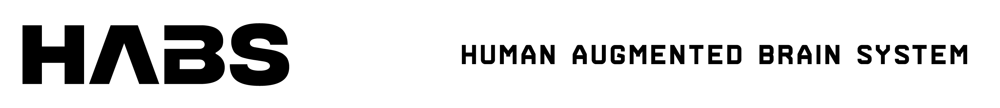
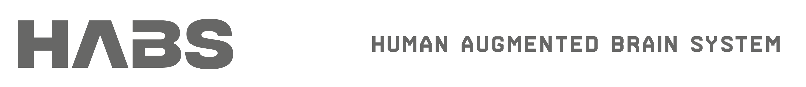

# HABS Assets

This repository contains all the visual assets for the **HABS** (Human Augmented Brain System) project, including various logo formats and image resources.

## Logo Variations

### Primary Logo Display

*HABS Logo - Light Theme (Black on White)*

*HABS Logo - Grey Theme (Grey on White/Black)*

*HABS Logo - Light Theme (Black on White)*

### Interactive Logo Toggles

<strong>🎨 Vertical Layout Logos</strong>

#### Light Theme (Black on White)

#### Dark Theme (White on Black)

#### Dark Theme (Grey on Black/White)

<strong>🔄 Horizontal Layout Logos</strong>

#### Light Theme (Black on White)

#### Dark Theme (White on Black)

#### Gray Theme (Gray on Black/White)

<strong>📱 Responsive Logo Variants</strong>

## Download Links

All assets are available for download from this repository. Click on any image above to view it in full resolution, or use the direct links below:

- [Primary Logo (Light)](./logo.png)
- [Primary Logo (Dark)](./logo_dark.png)
- [Primary Logo (Grey)](./logo_grey.png)
## Contributing

To add new logo variations or assets:
1. Ensure the design follows the established brand guidelines
2. Provide both light and dark theme versions
3. Include appropriate file formats (PNG, SVG)
4. Update this README with the new asset information

## License

These assets are proprietary to the HABS organization. Please contact us for usage permissions.

---

*Last updated: August 2025*
